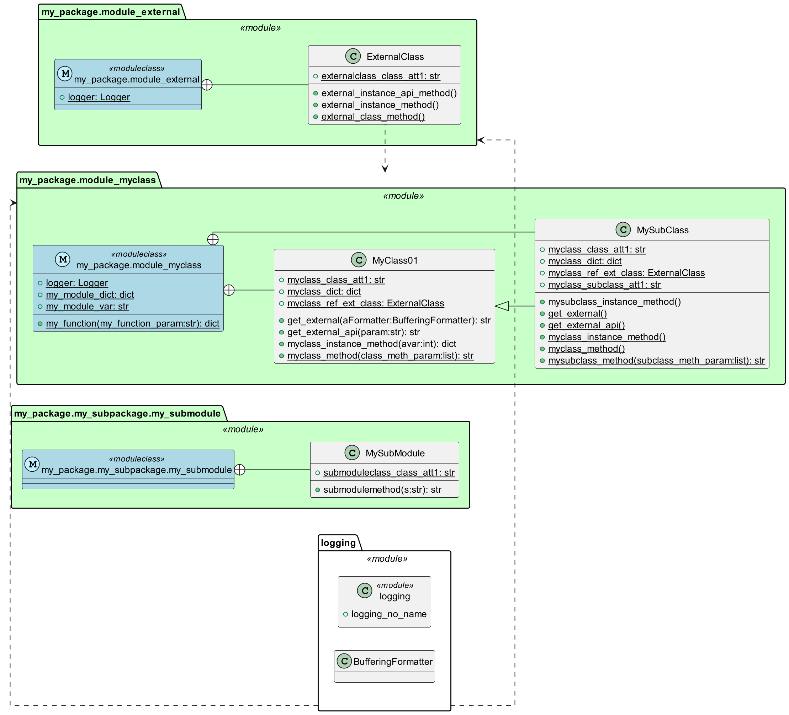

# Generating Class Diagrams with Plant UML using Inspect

The module `inspect_example.py` will create plant UML component and class diagrams to be generated with [plantuml](https://plantuml.com/en).

As opposed to to [`py2puml`](https://github.com/lucsorel/py2puml), also generation of the non class parts is supported

It will instanciate modules that are found in a root path and will try to get all all inner/external dependencies as well as inheritance relations.

**Usage**: Check the code in the `__main__` section of the file. In essence all you need to do is to import all required packages, define a root path and instanciate the model, and create the UML file from there.  

Afterwards you call `plantuml`to generate the image (shown for Windows):

```
cd "C:\<Path to your plantuml file>\"
# here we use filename test.plantuml
java -jar "C:\<path_to\plantuml.jar" test.plantuml
start test.png
```

**Generating the Class Diagram**  
A generated sample plantuml class diagram file using the classes in this folder: [`sample.plantuml`](artifacts/sample.plantuml).  


**NOTE**: Since Python also allows non encapsulated parts, these will be shown as a pseude class (shown as stereotype `<<moduleclass>>`). Any classes are shown as entities linked to this pseudo class.

**Generating the Component Diagram**  
A generated sample plantuml component diagram file using the classes in this folder: [`sample_package.plantuml`](artifacts/sample.plantuml).  
  
**NOTE**: This diagram requires the `tree utility` for generation

**Limitations**
* Annotations not supported