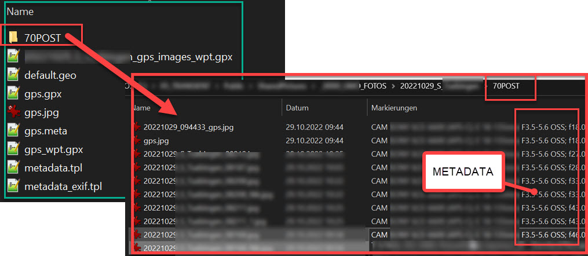

# Template Setup 

This readme should help you kickstart the Image Meta programs to tag image files with kewords / reverse geolocation information.
It will provide you you with the information how to structure / configure necessary data.

# File Structure
**Assumptions (Names in Brackets denote configuration variables)** 
* ``[CMD_EXIFTOOL]``: ``Exiftool`` is installed and accessible (=``PATH`` is set) 
* ``[P_CONTROL]``There is a dedicated folder hosting template files (````), hosting following files:
  * ``[CMD_EXIF_WAYPT_FMT]``: Waypoint Transformation file (copy from https://github.com/exiftool/exiftool/blob/master/fmt_files/gpx_wpt.fmt)
  * ``[META_PROFILES_FILE]`` Keyword Profiles file ([SAMPLE](metadata_exif_keywords_template.json) )
  * ``[KEYWORD_HIER_FILE]`` Hierarchy Keywords ([SAMPLE](metadata_hierarchy_template.txt))
  * ``[FP_METADATA_TPL]`` Control File Template (will be copied as file ``[F_METADATA]`` to image folders when using file validator, [SAMPLE (also contains hints)](metadata_template.tpl))

**All your images are organized in subfolders**  
For detailed setup and placement of working documents also check the template setup file for the image validator here  

  * ``[P_PHOTOS_ROOT]`` Image Root folder where you are working on your images
  * Folders contained in ``[IGNORE_FOLDERS_GPX]`` will be ignored for processing of geotags
  * ``[JPG_FOLDER_WAYPT]`` Final processed images are located in a subfolder of its own (``70POST`` used here)
  * ``[LATLON_HOME]`` Default LATLON location of your home location (will be used to calculate distances from photos to youtr home location and add it to your keywords)

# Setup
* Copy the validator setup template, define all path references  needed
* Change / Adjust the control File Template ``[FP_METADATA_TPL]`` ([metadata_exif_sample.tpl](metadata_exif_sample.tpl)) (Hints are provided in this file)
* Change / Adjust keyword profiles and Keyword Hoerarchy files as needed (``[KEYWORD_HIER_FILE],[META_PROFILES_FILE]``, see above)

